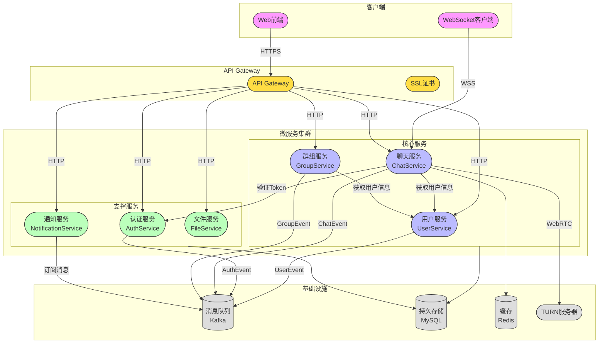

## 上下文图（Context Map）

本图展示系统各个边界上下文(微服务)及它们之间的交互关系，包括同步调用(HTTP/gRPC)、异步事件(Kafka)和数据访问

#### 关键组件说明
##### 前端应用
* Web前端(Vue3): 提供用户界面
* WebSocket客户端: 处理实时消息通信

##### API网关
* API Gateway: 统一接入层,处理请求路由
* SSL证书: 提供HTTPS/WSS安全通信

##### 核心服务
* 用户服务(UserService)
  * 用户信息管理
  * 联系人关系管理
  * 个人资料维护
* 聊天服务(ChatService)
  * 消息收发处理
  * WebSocket连接管理
  * 会话状态维护
  * WebRTC音视频通话
* 群组服务(GroupService)
  * 群组信息管理
  * 成员关系管理
  * 群消息转发

##### 支撑服务
* 认证服务(AuthService)
  * 用户认证(手机验证码/密码)
  * Token管理
  * 权限验证
* 通知服务(NotificationService)
  * 系统消息管理
  * 离线消息存储
  * 消息状态追踪
* 文件服务(FileService)
  * 文件上传下载
  * 文件格式验证
  * 存储管理

##### 基础设施
* 消息队列(Kafka)
  * 处理异步消息
  * 解耦服务通信
  * 确保消息可靠投递
* 数据存储(MySQL)
  * 用户数据
  * 消息记录
  * 关系数据
* 缓存(Redis)
  * 会话缓存
  * 验证码缓存
  * 热点数据缓存
* TURN服务器
  * WebRTC音视频中继
  * NAT穿透支持

#### 通信方式
##### 同步通信
* HTTP REST: 服务间普通请求
* gRPC: 服务间高性能调用
* WebSocket: 实时消息推送
* WebRTC: 音视频实时通话

##### 异步通信
通过Kafka消息队列实现:

* UserEvent: 用户相关事件
* AuthEvent: 认证相关事件
* ChatEvent: 消息相关事件
* GroupEvent: 群组相关事件

#### 安全机制
* SSL证书加密传输
* Token认证授权
* 文件上传验证
* 接口访问控制