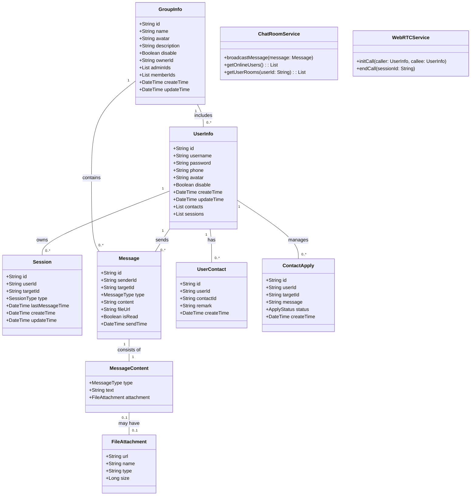

## 领域模型图
本图展示系统核心领域对象及其关系

### 说明

1. 聚合根:
- UserInfo: 用户信息聚合根
- GroupInfo: 群组信息聚合根 
- Session: 会话聚合根

2. 实体:
- Message: 消息实体
- UserContact: 联系人关系实体
- ContactApply: 好友申请实体

3. 值对象:
- MessageContent: 消息内容值对象
- FileAttachment: 文件附件值对象

4. 领域服务:
- ChatRoomService: 负责消息广播和在线用户管理
- WebRTCService: 处理音视频通话

5. 关键业务规则:
- 用户可以发送多种类型消息(文本/文件/视频)
- 支持一对一聊天和群组聊天
- 联系人关系需要双方确认
- 群组有所有者和管理员角色