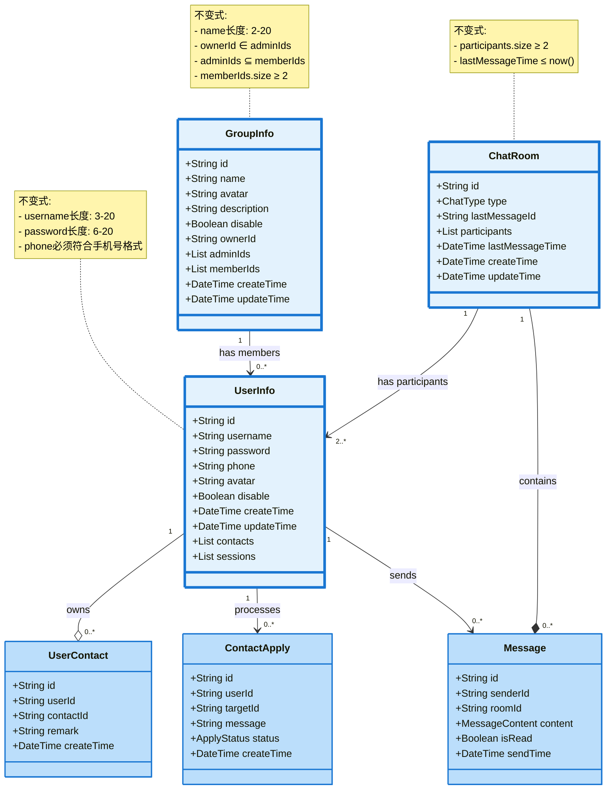
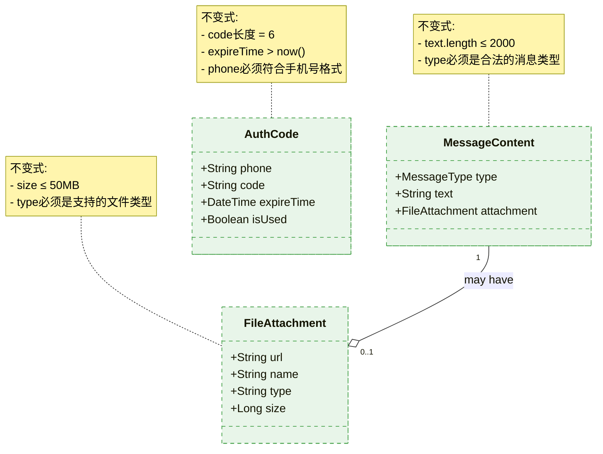
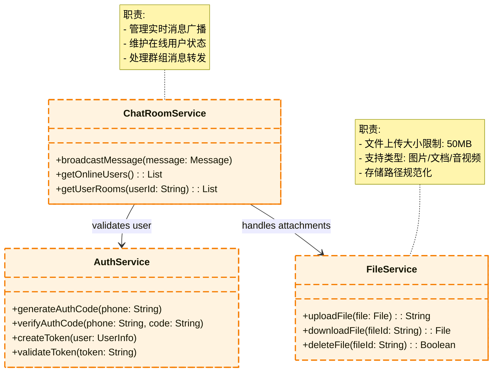

## 领域模型图
本图展示系统核心领域对象及其关系

#### 核心领域模型

#### 值对象模型

#### 领域服务模型

#### 说明

1. 聚合根:
- UserInfo: 用户信息聚合根
- GroupInfo: 群组信息聚合根 
- Session: 会话聚合根
- ChatRoom: 管理消息和会话

1. 实体:
- Message: 消息实体
- UserContact: 联系人关系实体
- ContactApply: 好友申请实体
- Notification: 系统通知实体
- FileUpload: 文件上传记录实体

1. 值对象:
- MessageContent: 消息内容值对象
- FileAttachment: 文件附件值对象
- AuthCode: 手机验证码
- Email: 邮箱值对象

1. 领域服务:
- ChatRoomService: 负责消息广播和在线用户管理
- WebRTCService: 处理音视频通话
- AuthService: 处理登录认证相关
- FileService: 处理文件上传下载
- NotificationService: 处理系统通知

1. 关键业务规则:
- 用户可以发送多种类型消息(文本/文件/视频)
- 支持一对一聊天和群组聊天
- 联系人关系需要双方确认
- 群组有所有者和管理员角色
- 用户可以使用手机验证码或账号密码登录
- 支持文件的上传、下载和管理
- 系统消息通知(如好友申请、群组邀请等)
- 邮箱验证功能
- 消息发送需要经过权限验证
- 文件上传有大小和类型限制
- 群组必须至少有2个成员
- 验证码有效期和使用限制