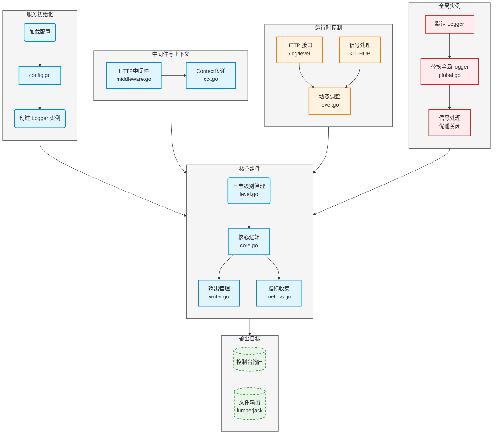

# 日志模块说明

本日志模块基于 Uber 开源的 Zap 日志库二次自定义封装而成，提供了**多目标输出**、**动态日志级别**、**Context 传递**、**可选指标埋点**等功能

## 模块架构图



## 核心功能
### 1. 全局实例管理 (global.go)
- 提供全局默认 logger
- 支持安全地替换全局实例
- 处理服务优雅关闭

### 2. 配置管理 (config.go) 
- 支持多环境配置
- 日志输出路径配置
- 日志级别配置
- 编码格式配置(JSON/Console)
- 文件切割配置

### 3. 日志级别管理 (level.go)
- 支持动态调整日志级别
- 提供HTTP接口动态修改
- 支持信号触发级别调整

### 4. 输出管理 (writer.go)
- 支持同时输出到多个目标
- 文件自动切割归档
- 并发安全的写入

### 5. 上下文集成 (ctx.go)
- 支持链路追踪
- Context传递关键信息
- 支持Fields扩展

### 6. 中间件支持 (middleware.go)
- 集成HTTP请求日志
- 记录请求耗时
- 支持自定义字段

### 7. 监控指标 (metrics.go)
- 统计日志数量
- 记录日志级别分布
- 监控写入延迟

## 使用示例

1. 基础使用:
```go
// 初始化全局 logger
zlog.MustInitGlobal(zlog.Config{
    Level:  "info",
    File: zlog.FileConfig{
        Path:   "logs/app.log",
        MaxSize: 100,    // MB
    },
})

// 记录日志
zlog.Info("user login", 
    zlog.String("user_id", "123"),
    zlog.Int("login_count", 5),
)
```

2. 带Context使用:
```go
logger := zlog.FromContext(ctx)
logger.Info("process message",
    zlog.String("msg_id", msgID),
    zlog.Any("payload", payload),
)
```

3. HTTP中间件:
```go
r := gin.New()
r.Use(zlog.GinLogger()) 
```

## 性能考虑
1. 使用sync.Pool复用对象
2. 支持采样记录
3. 异步写入选项
4. 批量写入缓冲

## 后续规划
1. 集成ELK支持
2. 完善告警机制
3. 增加更多监控指标
4. 支持日志采样
5. 增强链路追踪

## 注意事项
1. 正确设置日志级别避免性能问题
2. 定期清理归档日志
3. 合理配置文件切割大小
4. 避免频繁替换全局 logger
5. panic 前确保日志刷盘

## 技术选型相关

#### 为什么不选择热加载和 Kafka

* 目前项目规模较小
* 热加载主要用途是无需重启服务，能动态调整配置
    * 但目前重启服务来加载新配置成本很低
    * 引入热加载会额外依赖文件监听和并发锁，增加复杂度
* Kafka 更适合大规模分布式日志收集
    * 不打算接 ElasticSearch

后续搭建告警和监控的时候会重新评估考虑