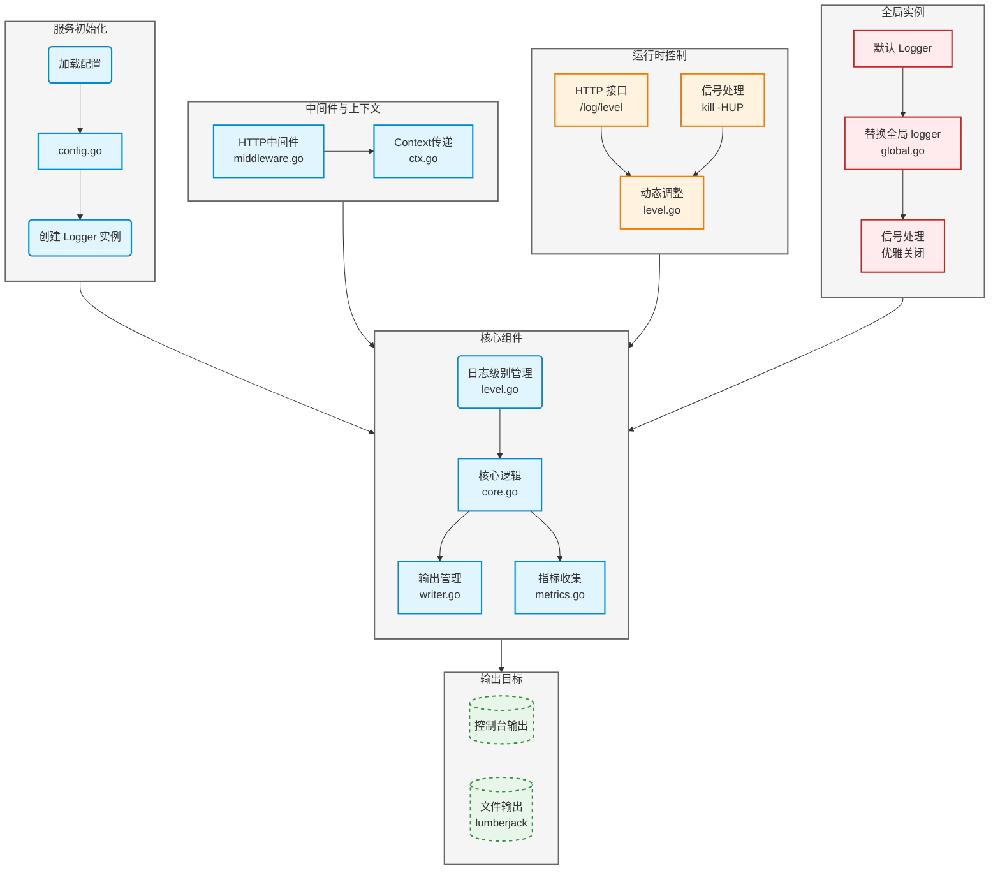

# 日志模块说明

本日志模块基于 Uber 开源的 Zap 日志库二次自定义封装而成，提供了**多目标输出**、**动态日志级别**、**Context 传递**、**指标埋点**等功能

## 模块架构图



## 快速上手
#### go.work 管理
假设你的项目结构如下：

    IM/
    ├── go.work
    ├── pkg/
    │   └── zlog/              ← 本模块
    └── services/
        └── myservice/         ← 你的微服务

在 `IM/` 根目录运行 `go work init ./pkg/zlog ./services/myservice`，此时在 `myservice` 下直接 `import "github.com/EthanQC/IM/pkg/zlog"` 即可引用本地日志模块

#### 使用示例
先在各个微服务的 `main` 文件中初始化：
```go
// 加载日志配置
cfgPath := "config/zlog.yaml"
cfg, err := zlog.LoadConfig(cfgPath)

if err != nil {
    panic("日志配置加载失败：" + err.Error())
}

// 初始化全局 logger
zlog.MustInitGlobal(*cfg)
defer zlog.Sync()

// 注册 Prometheus 指标（待具体实现）
// zlog.RegisterMetrics(prometheus.DefaultRegisterer)

// 加载 Gin 中间件
r := gin.New()
r.use(
    zlog.GinLogger(),
    gin.Recovery(),
)

// 动态调整日志级别
r.PUT("/log/level", zlog.LevelHTTPHandler())

// 暴露 Prometheus /metrics
// r.GET("/metrics", gin.WrapH(promhttp.Handler()))
```

基础使用:
```go
// 记录日志
zlog.Info("user login", 
    zlog.String("user_id", "123"),
    zlog.Int("login_count", 5),
)

zlog.Debug("开始处理任务", zlog.String("task_id", id))
```

带Context使用:
```go
logger := zlog.FromContext(ctx)
logger.Info("process message",
    zlog.String("msg_id", msgID),
    zlog.Any("payload", payload),
)
```

## 技术选型相关
#### 为什么不选择热加载和 Kafka

* 目前项目规模较小
* 热加载主要用途是无需重启服务，能动态调整配置
    * 但目前重启服务来加载新配置成本很低
    * 引入热加载会额外依赖文件监听和并发锁，增加复杂度
* Kafka 更适合大规模分布式日志收集
    * 不打算接 ElasticSearch

后续搭建告警和监控的时候会重新评估考虑