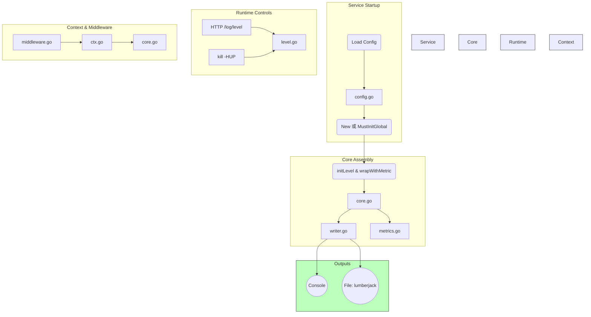

# 日志模块说明
本日志模块基于 Uber 开源的 Zap 日志库二次自定义封装而成，提供了**多目标输出**、**动态日志级别**、**Context 传递**、**可选指标埋点**等功能

### 文件及查看顺序
#### config.go 
使用 `viper` 第三方库管理配置信息，主要提供 `LoadConfig` 方法加载配置文件

负责加载并校验 `zlog.yaml`（或其他格式）配置，包括服务名、日志级别、编码、输出目标、文件轮转及指标开关等参数

#### level.go
基于原子操作实现了并发安全地热更新日志级别，

解析字符串到 `zapcore.Level`，提供热更新接口 `SetLevel` 和 HTTP 管理端点 `LevelHTTPHandler`  

#### writer.go
根据配置构建写入器：可选输出到 `stdout`、本地文件（lumberjack 轮转）、以及未来扩展的 Kafka/Loki/OTLP。  

#### core.go
核心组装：根据环境选择编码器（开发/生产）、构造 `zapcore.Core`（编码 + 写入 + 过滤），并附加 Caller、service 字段及可选 Prometheus 埋点。  

#### global.go
提供 `MustInitGlobal`：一行初始化全局 Logger，并注册 Unix 信号 `SIGHUP` 切换级别功能（`kill -HUP`）。  

#### ctx.go
基于 Go `context`，在请求链中传递 `*zap.Logger`：`WithContext` 注入，`FromContext/C` 安全取出并优雅回退。 

#### middleware.go
针对 Gin 框架的中间件示例：从 Context 拿 Logger，附加 traceID、requestID、HTTP 方法与路径，注入下游并在请求结束时打印访问日志。  

#### metrics.go
可选 Prometheus 指标：`app_log_total{service, level}` 计数，提供注册方法 `RegisterMetrics` 和 Zap Core 装饰器 `wrapWithMetric`。  

## 全局日志模块

为什么不选择热加载和 Kafka：

* 目前项目规模较小
* 热加载主要用途是无需重启服务，能动态调整配置
    * 但目前重启服务来加载新配置成本很低
    * 引入热加载会额外依赖文件监听和并发锁，增加复杂度
* Kafka 更适合大规模分布式日志收集
    * 不打算接 ElasticSearch

后续搭建告警和监控的时候会重新评估考虑