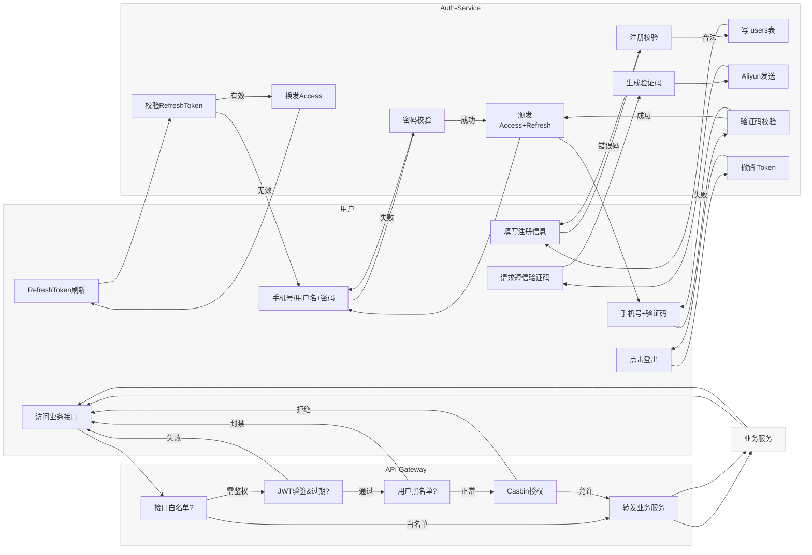

# `auth-service`
`Auth-Service` 提供统一的身份认证与权限管理能力，包含登录认证、令牌中心、RBAC 授权、短信验证码等模块，对外暴露 HTTP / gRPC 两套接口

## 常用命令
* 后台(detached) 启动容器：`docker compose up -d`
  * 终端可立即退出，日志可用 `docker compose logs -f` 查看
* 前台启动并实时打印容器日志：`docker compose up`
  * `Ctrl-C` 会把容器一起停掉
* 进入容器的 MySQL Shell：`docker exec -it auth_mysql mysql -u root -p wkr1835484520 auth_service`
* 进入容器的 redis cli：`docker exec -it auth_redis redis-cli`

## 业务流程
#### 注册（注册成功后才能登录）
* 填写信息
  * 手机号 + 密码（前端再提示用户设置用户名）
  * 用户名 + 密码（前端再提示用户设置手机号）
  * 增：邮箱注册
* 校验
  * 手机号：11 位大陆手机号码
  * 用户名：中文/英文/数字，2 - 20 字符，禁止特殊符号，必须唯一
  * 密码：6 - 20 位，必须同时包含字母和数字
  * 补：手机号或用户名是否已存在
* 结果
  * 任一字段不合法都会返回对应的错误码，前端再提示错误类型
  * 全部合法则会写表，返回 `201 Created`，前端再提示注册成功

#### 登录
* 登录是身份验证 AuthN，解决你是谁
* 登陆方式
  * 手机号 + 密码
  * 手机号 + 短信验证码
  * 用户名 + 密码
* 校验
  * 手机号、用户名和密码同注册
  * 验证码有效期为五分钟，主要校验是否过期
  * 短信验证码登录先走 `/sms/send` 接口获取验证码，失败次数 `> N` 时加图形验证码 / 人机验证，防止暴力破解
* 登录通过后返回 `access_token (15 min) + refresh_token (7 d)`
* 登录逻辑不判断权限，它只确定身份并发放令牌

#### 令牌
| 类型 | 存储 | 作用 |
| --- | --- | --- |
| Access Token | 不入库，前端持有；Redis 记录撤销列表 | 每次请求携带，用于快速校验 |
| Refresh Token | `refresh_tokens` 表，索引 `user_id` + 过期时间 | 用于在 Access Token 过期前无感续期 |

* 生命周期
  * 当 Access Token 失效时，前端用 Refresh Token 换新
  * 当 Refresh Token 被撤销或过期时，会强制用户重新登录
* 撤销
  * 用户主动登出或有异常风险时
    * 将 Access Token 哈希写入 Redis 黑表
    * Refresh Token 标记 `IsRevoked = 1`
* 增：加一个 `/introspect` 或 `/validate` 端点给网关或其他服务快速校验令牌，避免业务服务重复解析 JWT

#### 角色与权限
* 角色与权限是 AuthZ，解决你能干什么
* 权限
  * 允许对某个资源做某个动作
  * 比如删除好友、`post:delete`、`user:ban`
* 角色
  * 是权限的批量化
  * 一个角色可以有多个权限，方便我们快速指派多个权限
* 动态变更
  * 改动后先写角色权限字段
  * 然后发送权限变更事件
  * Casbin Watcher 会触发各实例重新加载权限
* 记录权限变更审计（谁在什么时候给谁加了什么权限）

#### 黑白名单
| 名称 | 用途 | 存放 |
| --- | --- | --- |
| 接口白名单 | 无需令牌即可访问（静态资源/注册/登录/健康检查） | 配置文件 |
| 用户黑名单 | 封禁账号：拦截登录、刷新、接口访问 | `users.status = blocked` + Redis 缓存 |
| IP 黑名单 / 限流 | 防刷 / 放爆破，支持滑动窗口速率限制 | Redis Bucket + Nginx/LB |

#### 其他
* 忘记密码 / 重设密码
* 注销账号
* 审计日志 & Prometheus 指标
* 安全告警（登录异常通知）

#### 主流程
注册 → 登录（获取 JWT）→ 前端请求业务接口（带 Access Token）→ API 网关执行：
① 接口是否白名单？→ 放行 | ② 解析 JWT（签名/过期/撤销）（令牌是否过期？用户是否主动 Logout？）| ③ 用户是否黑名单？| ④ Casbin 鉴权 | ⑤ 调用业务服务



## 架构总览

```mermaid
%%{ init: { 'theme': 'default', 'flowchart': { 'rankdir': 'LR' } } }%%
flowchart LR
  %% ========== Clients ==========
  subgraph Clients
    fe[Web / App]:::actor
    grpcCli[gRPC Client]:::actor
  end

  %% ========== Gateway ==========
  apigw[API-Gateway<br/>+ 验证中间件]

  fe -->|HTTP/JSON| apigw
  grpcCli -->|gRPC| apigw

  %% ========== Auth-Service ==========
  subgraph Auth-Service
    direction TB
    httpIn[HTTP Handler]
    grpcIn[gRPC Server]
    useCase[Application<br/>UseCase]
    domain[Domain<br/>Entity + VO + Service]
  end

  apigw --> httpIn
  apigw --> grpcIn
  httpIn --> useCase
  grpcIn --> useCase
  useCase --> domain

  %% ========== Adapters / Infra ==========
  subgraph Storage
    redisT[(Redis<br/>TokenRepo)]:::db
    redisC[(Redis<br/>AuthCodeRepo)]:::db
    mysqlU[(MySQL<br/>UserRepo)]:::db
    mysqlP[(MySQL<br/>PolicyRepo)]:::db
  end

  subgraph External
    aliyun[(Aliyun SMS)]:::ext
    casbin[(Casbin Enforcer<br/>+ Watcher)]:::ext
    prom[(Prometheus)]:::ext
  end

  useCase --> redisT & redisC & mysqlU & mysqlP
  useCase --> aliyun
  apigw -. metrics .-> prom
  casbin <-- watcher --> mysqlP
  apigw -. 权限查询 .-> casbin

  classDef actor fill:#ffebf0,stroke:#d63384;
  classDef db fill:#e7f5ff,stroke:#1c7ed6;
  classDef ext fill:#fff9db,stroke:#f08c00;
  ```
