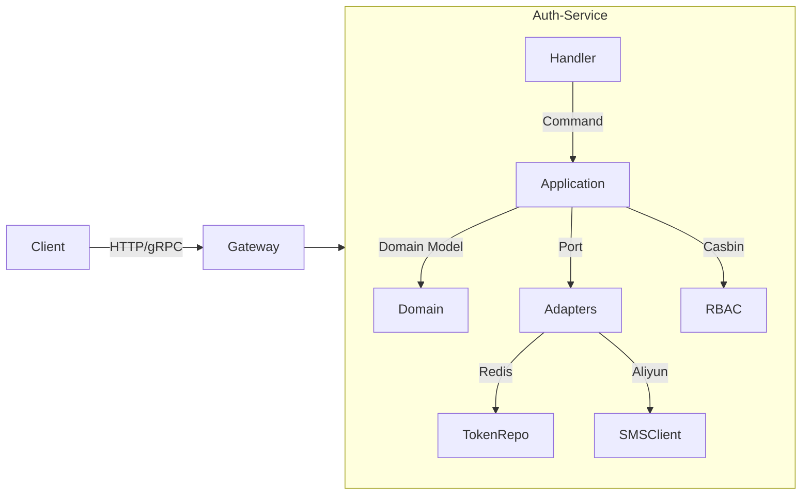

# `auth-service`
`Auth-Service` 提供统一的身份认证与权限管理能力，包含登录认证、令牌中心、RBAC 授权、短信验证码等模块，对外暴露 HTTP / gRPC 两套接口

## 架构总览

```mermaid
flowchart LR
    Client -->|HTTP/gRPC| Gateway
    subgraph Auth-Service
        direction TB
        Handler -->|Command| Application
        Application -->|Domain Model| Domain
        Application -->|Port| Adapters
        Adapters -->|Redis| TokenRepo
        Adapters -->|Aliyun| SMSClient
        Application -->|Casbin| RBAC
    end
    Gateway --> Auth-Service
```