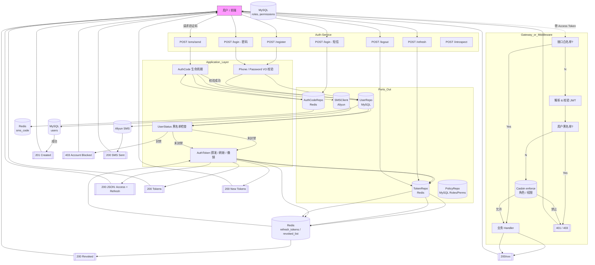

# `auth-service`
`Auth-Service` 提供统一的身份认证与权限管理能力，包含登录认证、令牌中心、RBAC 授权、短信验证码等模块，对外暴露 HTTP / gRPC 两套接口

## 业务流程
#### 注册
用户进来会先注册，可以使用手机号+密码或用户名+密码这两种方式注册，如果是前者会提示填写用户名，如果是后者会提示填写手机号

注册时会对手机号、用户名和密码规则分别进行校验

手机号是 11 位的大陆手机号码，用户名可以中文可以英文，但不能包含特殊字符，也不能重复，密码是 6-20 位，必须包含数字和字母

如果手机号、用户名和密码哪个不符合规则，会提示用户重新填写

注册成功会给反馈，只有注册成功后才能登录

#### 登录
登录时是进行身份验证，解决你是谁的问题，会看用户的角色是什么

用户可以使用手机号+密码/手机号+短信验证码/用户名+密码三种方式登录，登录时同样会对手机号、用户名、密码和短信验证码进行校验

如果校验通过，后端服务器会返回一个 JWT 令牌

#### 角色与权限

#### 令牌

#### 黑白名单

#### 主流程
注册——登录——请求接口

## 架构总览

